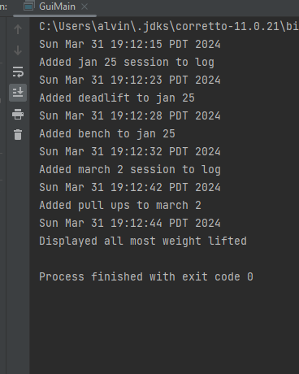

# My Personal Project

## Task 1 
A workout routine organizer. 

## Task 2
My project will be an application which tracks fitness progress and stores past workouts. 
This can include weight lifting and personal records 
An example of a function that this application will have is being able to have accurate statistics
(ex. most weight lifting in a single session) that summarize a user's fitness journey. 
The classes will keep track of information for each exercise within a session (ex. repetitions, sets, weight). 

Since 2023 just ended, I believe many people are interested in becoming a better version of themselves
through improving their confidence and athleticism. This will keep track of their progress while 
organizing their personal goals and records. This project interests me due to my passion for trying 
out new skills and learning. I have been weight lifting since the start of school year and have been 
trying to get better at swimming to improve my cardio. There are many applications which track workouts 
and goals, but I believe that staying organized also means using tools which are made **specifically for 
a person**. My goal is to create a program which can be used by a wider range of people, but still simple
enough to personalize. 

## Task 3 - User Stories
- As a user, I want to add a recent weight lifting session to my tracker along with 
the exercises done
- As a user, I want to add a certain exercise to my weight lifting session along with 
the amount of sets, repetitions and weight done for that exercise 
- As a user, I want to see a list of the personal records set for each exercise along with the respective dates 
- As a user, I want to see the amount of times I have went to the gym 

## Phase 2 - User stories 
- As a user, I want to save my gym logs and personal best entries to file (if I so choose). 
- As a user, when the FitnessApp application starts, I want to have the option of loading my workout records 
(sessions and personal bests) and history from file. 

## Phase 3 - Instructions for Grader 
- You can generate the first required action related to the user story "adding multiple Xs to a Y" by
entering a date, clicking next, inputting the exercise name, weight, reps/sets, then clicking submit, from
there you can add another exercise by filling in the fields again, or click done to add another session 
- You can generate the second required action related to the user story "adding multiple Xs to a Y" by clicking the 
personal best button on the first page which will display that information in the text field below 
- You can locate my visual component easily, always displayed on the right side of the application 
- You can save the state of my application by clicking the save button at the bottom of the screen on the first page
- You can reload the state of my application by clicking the load button at the bottom of the screen on the first page

## Phase 4: Task 2
